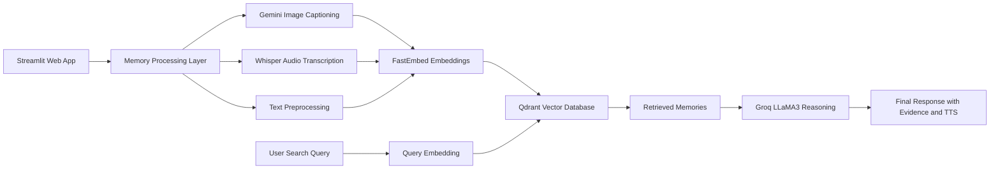
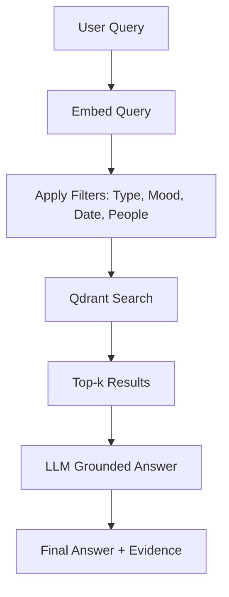
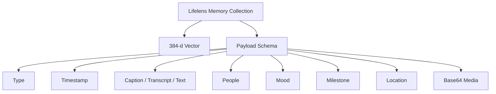

<div align="center">

# 🧠 LifeLens  
### **AI-Powered Multimodal Memory Companion for Dementia Care**

_Addressing Memory Loss • Strengthening Relationships • Enhancing Care_

[](https://streamlit.io/)
[](https://qdrant.tech/)
[](https://groq.com/)
[](https://aistudio.google.com/)
[](LICENSE)
[](https://lifelens-lls.streamlit.app/)

---

### **“Because memories deserve to be remembered.”**

🔗 **Live Demo:** https://lifelens-lls.streamlit.app/

</div>

---

## 🌟 Overview
**LifeLens** is a multimodal AI memory companion designed for dementia and Alzheimer’s patients.  
It builds a **long-term digital memory vault** using:

- Image captioning  
- Audio transcription  
- Text notes  
- Mood detection  
- People tagging  
- Location metadata  
- Milestones  

All memories are embedded using **FastEmbed** and stored in **Qdrant**, enabling semantic recall and grounded reasoning with **Groq LLaMA-3**.

LifeLens provides separate portals for:

- Patients  
- Caretakers  
- Family Members  

---

# 🧩 Why Qdrant Is the Core of LifeLens

LifeLens uses Qdrant as the backbone for **search**, **memory**, and **recommendation**.

### 🔍 Multimodal Semantic Search
- Stores embeddings for image captions, audio transcripts, and text memories  
- Uses cosine similarity for natural language search  
- Supports hybrid metadata filters  

### 🧠 Long-Term Memory Storage
- Every memory persists indefinitely  
- No contextual forgetting  
- Enables timeline reconstruction and reminiscence therapy  

### 🎯 Recommendations  
- Related memories  
- Time-based clusters  
- Mood-based associations  
- Person-based clustering  

### ⚙️ Fast and Scalable
- Low-latency queries  
- Instant upserts  
- Handles thousands of memories per patient  

### 📦 Memory Payload Example

```json
{
  "type": "image",
  "timestamp": 1700000000,
  "caption": "Man smiling at a beach",
  "transcript": null,
  "content": null,
  "people": ["John"],
  "mood": "happy",
  "milestone": true,
  "location": "Mumbai, India",
  "lat": 19.076,
  "lon": 72.8777,
  "raw_media_b64": "..."
}
```

---

## 🎯 Key Features

### 🔐 Security & Roles
- Patients  
- Caretakers  
- Family Members  
- SHA-256 password hashing  
- Persistent sessions  

### 📸 Memory Ingestion
- Gemini image captioning  
- Groq Whisper audio transcription  
- Text memory creation  
- Mood detection  
- People tagging  
- Milestones  

### 🔍 AI Retrieval & Reasoning
- Semantic search (Qdrant)  
- Voice search  
- Related memory suggestions  
- Explainable AI (evidence displayed)  
- Text-to-speech output  

### 🛡 Caretaker Dashboard
- Mood trends  
- Memory analytics  
- People directory  
- Exportable memory book  
- Respond to memory requests  

### 👨‍👩‍👧 Family Portal
- View-only access  
- Timeline of milestones  
- Gallery view  
- Submit memory requests  

### 🗺 Location Mapping
- Global memory map  
- Geocoding search  
- Color-coded markers  

---

# 🏛 System Architecture

## 🛰 High-Level Architecture



---

## 🔄 Memory Retrieval Flow



---

## 🗄 Qdrant Collection Architecture



---

# 🧱 Technology Stack

### **Frontend**
- Streamlit  
- Custom CSS  

### **AI Models**
- Gemini 1.5 Flash  
- Groq Whisper  
- Groq LLaMA-3  
- FastEmbed  

### **Vector Database**
- Qdrant Cloud  

### **Other**
- geopy  
- OpenStreetMap  
- SHA-256 hashing  
- Base64 media  

---

# 🚀 Quick Start

```bash
git clone https://github.com/yourusername/lifelens.git
cd lifelens
pip install -r requirements.txt
streamlit run app.py
```

### 🔐 Add Secrets

Create this file: `/.streamlit/secrets.toml`

```toml
QDRANT_URL = "..."
QDRANT_API_KEY = "..."
GROQ_API_KEY = "..."
GEMINI_API_KEY = "..."
```

Deploy to Streamlit Cloud and paste the same secrets.

---

# ⚠ Limitations & Ethics

LifeLens is designed for healthcare & accessibility, which requires careful responsibility.  
Below are the **transparent limitations and ethical considerations**, as required by the Qdrant Convolve 4.0 guidelines.

---

## 🔸 **Technical Limitations**
- **No face recognition** (privacy-first) — people tagging is manual  
- **Mobile responsiveness limited** due to Streamlit constraints  
- **Large base64 media payloads** may increase Qdrant storage usage  
- **Audio sentiment detection** may occasionally misclassify mood  
- **No offline mode** (cloud-only system)  

---

## 🔸 **Memory & Retrieval Limitations**
- Memories cannot yet be merged into "clusters" automatically  
- Long-term memory does not decay or auto-update  
- Search quality depends on embedding model (FastEmbed)  
- No support yet for:
  - video memories  
  - multi-language memories  

---

## 🔸 **Ethical Considerations**
### 🛡 **1. Privacy & Consent**
- All uploaded data is personal and potentially sensitive  
- Only authenticated roles can access memory  
- Family members have view-only access to avoid accidental edits  

### 🧭 **2. Responsible AI**
- No hallucinations: LLM answers ONLY depend on Qdrant-retrieved memories  
- Evidence is always shown alongside responses  
- No predictions or medical advice  

### 🔒 **3. Security**
- Passwords are SHA-256 hashed  
- No plaintext storage  
- No external unverified data ingestion  

### ❤️ **4. Human Impact**
- LifeLens is assistive, not diagnostic  
- Designed to support memory and emotional well-being  
- Encourages family connection rather than replacing caregivers  

---

# 🛣 Roadmap

- MFA login  
- Video memory support  
- Mobile app (Flutter)  
- On-device face recognition  
- Multi-language UI  
- Auto-generated memory summaries  

---

<div align="center">

### ❤️ _LifeLens — Bringing Memories Back to Life._

</div>
