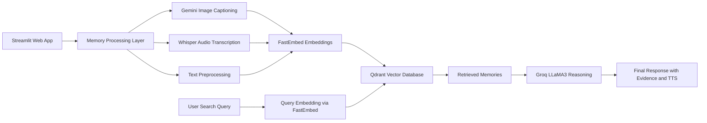
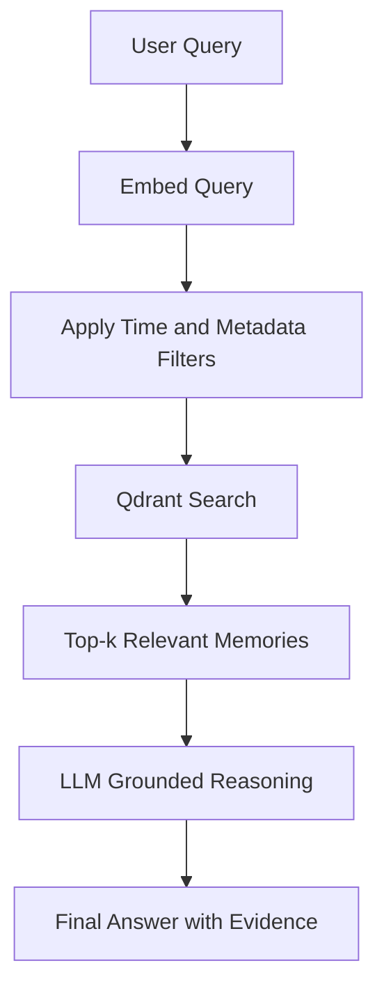
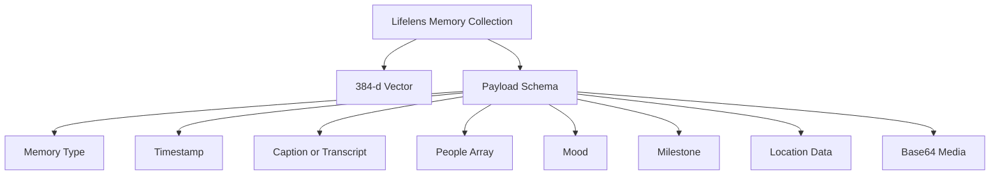

<div align="center">

# 🧠 LifeLens  
### **AI-Powered Multimodal Memory Companion for Dementia Care**

_Addressing Memory Loss • Strengthening Relationships • Enhancing Care_

[](https://streamlit.io/)
[](https://qdrant.tech/)
[](https://groq.com/)
[](https://aistudio.google.com/)
[](LICENSE)
[](https://lifelens-lls.streamlit.app/)

---

### **“Because memories deserve to be remembered.”**

🔗 **Live App:** https://lifelens-lls.streamlit.app/

</div>

---

## 🌟 Overview
LifeLens is an AI-powered, multimodal memory assistant designed for dementia and Alzheimer’s patients. The system supports:

- Images (captioned via Gemini)
- Audio (transcribed via Whisper)
- Text notes
- Moods & sentiments
- Locations
- People tagging
- Milestones

All stored in **Qdrant** with long-term memory retrieval using **semantic search** and **LLM reasoning**.

---

# 🧩 Why Qdrant Is the Core of LifeLens

LifeLens uses Qdrant for:

### 🔍 Multimodal Semantic Search
- Stores dense embeddings for image captions, audio transcripts, text notes  
- Enables natural language recall  
- Supports hybrid metadata filtering  

### 🧠 Long-Term Memory
- Persistent storage of all memories  
- No overwriting — everything remains retrievable  

### 🎯 Recommendations
- Related memory graph  
- Person similarity  
- Mood-based memory exploration  

### ⚙️ Real-Time Vector Search
- Low latency  
- Scalable  
- Ideal for memory-based AI agents  

### 📦 Memory Payload Structure

```json
{
  "type": "image",
  "timestamp": 1700000000,
  "caption": "A happy person standing near a beach",
  "transcript": null,
  "content": null,
  "people": ["John"],
  "mood": "happy",
  "milestone": true,
  "location": "Mumbai, India",
  "lat": 19.076,
  "lon": 72.8777,
  "raw_media_b64": "..."
}
```

---

## 🎯 Key Features

### 🔐 Security & Multi-User Roles
- Patients  
- Caretakers  
- Family (view-only)  
- SHA-256 login  
- Session-based authentication  

### 📸 Memory Ingestion
- Image captioning (Gemini 1.5 Flash)  
- Audio transcription (Groq Whisper)  
- Text notes  
- Mood detection  
- People tagging  
- Milestone support  

### 🔍 Retrieval & Reasoning
- Semantic search using Qdrant  
- Voice search  
- Related memory suggestions  
- TTS responses  

### 🛡 Caretaker Dashboard
- Memory analytics  
- Mood trends  
- People gallery  
- Memory book export  
- Manage memory requests  

### 👨‍👩‍👧 Family Portal
- Timeline  
- View-only gallery  
- Submit memory requests  

### 🗺 Location Mapping
- OSM-based map view  
- Geocoding  
- Color-coded markers  

---

# 🏛 System Architecture

Below are **fully GitHub-safe Mermaid diagrams**, validated for correct rendering.

---

## 🛰 High-Level Architecture



---

## 🔄 Memory Retrieval Flow



---

## 🗄 Qdrant Collection Architecture



---

# 🧱 Technology Stack

### **Frontend**
- Streamlit + Custom CSS

### **AI Processing**
- Google Gemini 1.5 Flash  
- Groq Whisper  
- Groq LLaMA-3  
- FastEmbed

### **Vector Storage**
- Qdrant Cloud

### **Mapping**
- OpenStreetMap  
- geopy

### **Security**
- SHA-256 password hashing  
- Session management  

---

# 🚀 Quick Start

```bash
git clone https://github.com/yourusername/lifelens.git
cd lifelens
pip install -r requirements.txt
streamlit run app.py
```

### 🔐 Add Secrets (Streamlit Cloud)

`/.streamlit/secrets.toml`:

```toml
QDRANT_URL = "..."
QDRANT_API_KEY = "..."
GROQ_API_KEY = "..."
GEMINI_API_KEY = "..."
```

---

# 🛣 Roadmap

- MFA login  
- On-device face recognition  
- Video memories  
- Mobile app  
- Multi-language support  

---

# 📄 Note
Open for Contributions and Forking

---

<div align="center">

### ❤️ _LifeLens — Bringing Memories Back to Life._

</div>
