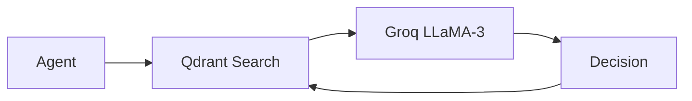
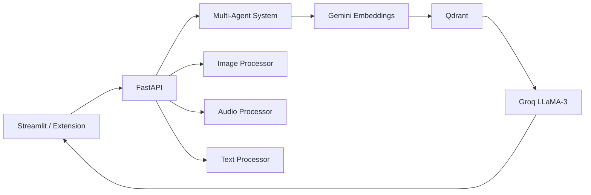
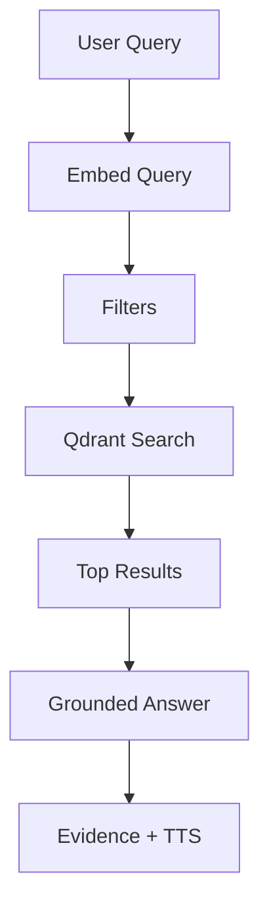
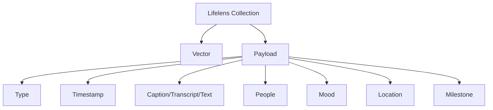

# 🧠 **LifeLens**

### **AI-Powered Multimodal Memory Companion for Dementia Care**

> **Because memories deserve to be remembered.**

🔗 **Live Demo:** [https://lifelens-lls.streamlit.app/](https://lifelens-lls.streamlit.app/) (the final version is not deployed, this version is the first prototype that got me shortlisted)

---

<div align="center">

[](https://streamlit.io/)
[](https://qdrant.tech/)
[](https://groq.com/)
[](https://aistudio.google.com/)
[](https://fastapi.tiangolo.com/)
[](LICENSE)

</div>

---

## 📌 Table of Contents

* Overview
* Qdrant at the Core
* Problem → Solution
* Core Features
* Multi-Agent System
* System Architecture
* Memory Retrieval Flow
* Qdrant Collection Design
* Browser Extension
* Technology Stack
* Installation
* Security & Ethics
* Limitations
* Roadmap
* Stats & Achievements

---

# 🌟 Overview

**LifeLens** is a multimodal AI platform for dementia and Alzheimer’s care.

It builds a **long-term digital memory vault** using:

📸 Images • 🎤 Audio • 📝 Text • 😊 Mood detection
👥 People tagging • 📍 Location metadata • ⭐ Milestones

All memories are embedded, stored in **Qdrant**, retrieved via **semantic search**, and reasoned over using **Groq LLaMA-3** inside a **multi-agent orchestration layer**.

LifeLens supports:

• Patients
• Caretakers
• Family Members

---

# 💜 Qdrant at the Core of LifeLens

> **LifeLens is architected around Qdrant—not merely connected to it.**
> Every memory, mood signal, medication event, alert, and agent decision ultimately flows through Qdrant Cloud.

In LifeLens, Qdrant functions as:

🧠 the system’s **long-term digital memory**
🔎 the **semantic recall engine**
⚡ the **real-time analytics backbone**
🛡 the **privacy-first data vault**
🤖 the **grounding layer for multi-agent reasoning**

---

## 🔍 How LifeLens Uses Qdrant

Every experience is embedded and written into Qdrant:

• photos and captions
• voice notes
• daily journals
• mood signals
• medication logs
• therapy sessions
• agent decisions

When a query or alert occurs:

1️⃣ Gemini generates embeddings
2️⃣ Qdrant performs vector + metadata search
3️⃣ agents reason only over retrieved payloads
4️⃣ a Critic validates conclusions
5️⃣ results are persisted back into Qdrant


```mermaid
flowchart LR
Agent --> QDR[Qdrant Search]
QDR --> LLM[Groq LLaMA-3]
LLM --> DEC[Decision]
DEC --> QDR
```

---

## ⚡ Why Qdrant Was Chosen

| Requirement          | Qdrant Advantage         |
| -------------------- | ------------------------ |
| Hybrid filtering     | Native payload indexes   |
| Low latency          | Sub-200ms retrieval      |
| Agent workflows      | Fast read/write cycles   |
| Healthcare isolation | Patient-scoped queries   |
| Explainability       | Evidence-first responses |
| Scalability          | Cloud-ready collections  |

---

## 🛡 Responsible AI Through Retrieval

LifeLens enforces safety using Qdrant:

• LLMs only see retrieved memories
• alerts always cite evidence
• family portals are read-only
• caretaker actions logged
• audit trails stored

**Without Qdrant’s retrieval-first architecture, this safety model breaks.**

---

# 🎯 Problem → Solution

| Challenge         | LifeLens Solution      |
| ----------------- | ---------------------- |
| Memory loss       | Permanent vector store |
| Caregiver burden  | Monitoring agents      |
| Mood decline      | Risk alerts            |
| Medication misses | Smart reminders        |
| Fragmented care   | Unified system         |
| Social isolation  | Family portals         |

---

# ✨ Core Features

| Area           | Capabilities               |
| -------------- | -------------------------- |
| Memory Capture | Image/audio/text ingestion |
| Search         | Semantic + filters         |
| Agents         | Planner-Critic-Executor    |
| Medication     | Schedules & alerts         |
| Mood           | Risk detection             |
| Family         | Read-only access           |
| Maps           | Location view              |
| Extension      | Browser capture            |

---

# 🤖 Multi-Agent System

```
User → Planner → Specialists → Critic → Executor → Response
                       ↑
                     Qdrant
```

Agents include:

Mood • Medication Planner • Adherence • Scheduler
Analytics • Recommender • Summary • Trigger

---

# 🏗 System Architecture


```mermaid
flowchart LR
UI[Streamlit / Extension] --> API[FastAPI]
API --> AG[Multi-Agent System]
AG --> EMB[Gemini Embeddings]
EMB --> QDR[Qdrant]

API --> IMG[Image Processor]
API --> AUD[Audio Processor]
API --> TXT[Text Processor]

QDR --> LLM[Groq LLaMA-3]
LLM --> UI
```

---

# 🔄 Memory Retrieval Flow


```mermaid
flowchart TD
QRY[User Query] --> EMBQ[Embed Query]
EMBQ --> FILT[Filters]
FILT --> QDR[Qdrant Search]
QDR --> TOPK[Top Results]
TOPK --> LLM[Grounded Answer]
LLM --> RESP[Evidence + TTS]
```

---

# 🗄 Qdrant Collection Design


```mermaid
flowchart TD
COL[Lifelens Collection] --> V[Vector]
COL --> PAY[Payload]
PAY --> T[Type]
PAY --> TS[Timestamp]
PAY --> CAP[Caption/Transcript/Text]
PAY --> PPL[People]
PAY --> MD[Mood]
PAY --> LOC[Location]
PAY --> MS[Milestone]
```

---

# 🌐 Browser Extension

| Feature          | Description   |
| ---------------- | ------------- |
| Right-click Save | Capture pages |
| Popup UI         | Quick notes   |
| JWT Auth         | Secure        |
| Offline Queue    | Planned       |
| Direct API       | Yes           |

---

# 🛠 Technology Stack

### Frontend

| Tool      | Role      |
| --------- | --------- |
| Streamlit | Dashboard |
| Plotly    | Charts    |
| Folium    | Maps      |

### Backend

| Tool    | Role   |
| ------- | ------ |
| FastAPI | APIs   |
| JWT     | Auth   |
| Uvicorn | Server |

### AI

| Model        | Use                 |
| ------------ | ------------------- |
| Gemini       | Vision + embeddings |
| Groq Whisper | Audio               |
| LLaMA-3      | Agents              |

### Database

| Tool         | Role      |
| ------------ | --------- |
| Qdrant Cloud | Vector DB |

---

# 📦 Installation

```bash
git clone <repo>
cd lifelens
pip install -r requirements.txt
streamlit run app.py
```

`.env`

```env
QDRANT_URL=
QDRANT_API_KEY=
GEMINI_API_KEY=
GROQ_API_KEY=
JWT_SECRET=
NTFY_TOPIC_URL=
```

---

# 🔐 Security & Ethics

• SHA-256 hashing
• JWT auth
• RBAC
• HTTPS
• Evidence-based AI
• Assistive, not diagnostic

---

# ⚠ Limitations

• No face recognition
• Mobile UI limited
• Offline mode pending
• Video ingestion pending
• Multilingual coming

---

# 🚀 Roadmap

Short-term: Mobile • Video • Voice
Mid-term: Wearables • Telehealth
Long-term: VR • Trials • Federated ML

---

# 📊 Stats

| Metric      | Value     |
| ----------- | --------- |
| LOC         | 15k+      |
| Agents      | 18        |
| Collections | 9         |
| Dev Time    | 1 week |

---

# 🏆 Achievements

• Qdrant Convolve 4.0
• Multi-agent healthcare system
• Open-source
• Accessibility focus
• Solo Participant


---

<div align="center">

### ❤️ LifeLens — Bringing Memories Back to Life

**Helping people remember what matters most.**

Built for **Change & Betterment of Society**

</div>
